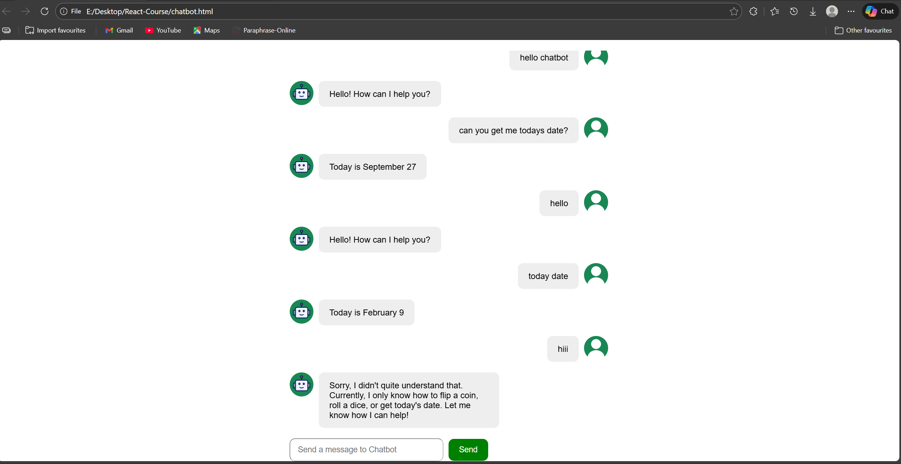
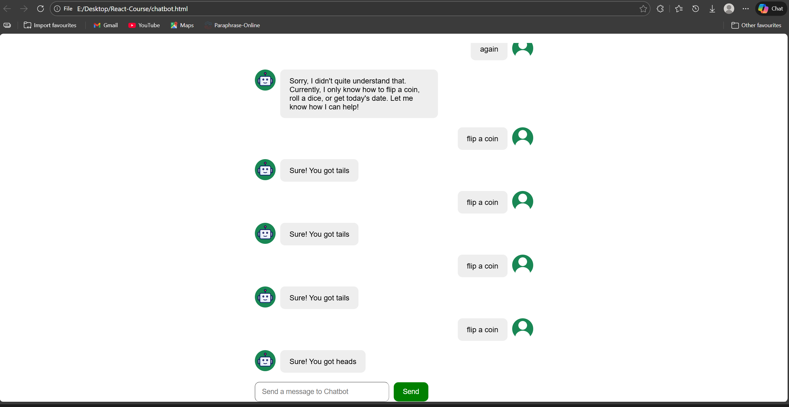
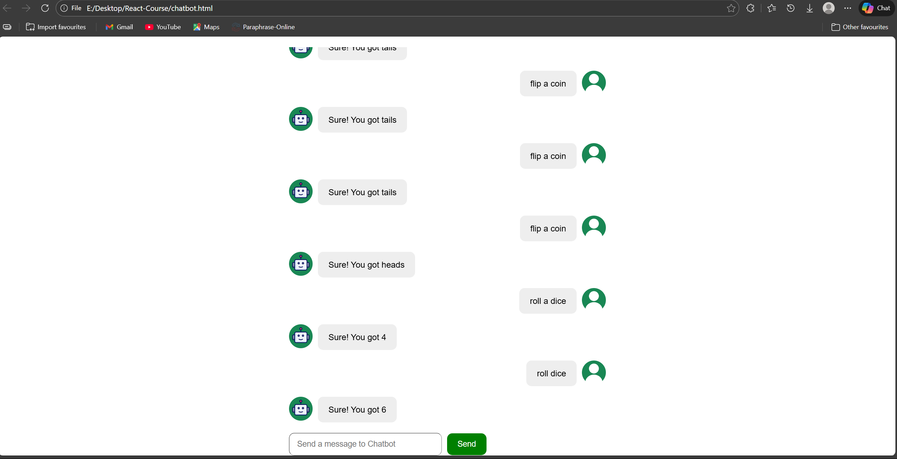

# Chatbot React App

## 🤖 Chatbot Features

This chatbot is a lightweight rule-based application developed with **React + Vite (JavaScript)**.

### Current capabilities:
- 🪙 Coin flip simulation
- 🎲 Dice roll simulation
- 📅 Displaying the current date

Future improvements may include expanded conversational logic and additional utilities.


## 🚀 Live Demo
 https://chatbot-react-nine.vercel.app

## 📸 Screenshots






## 🛠 Tech Stack
- React
- Vite
- JavaScript
- CSS

## ▶️ Run Locally
```bash
npm install
npm run dev